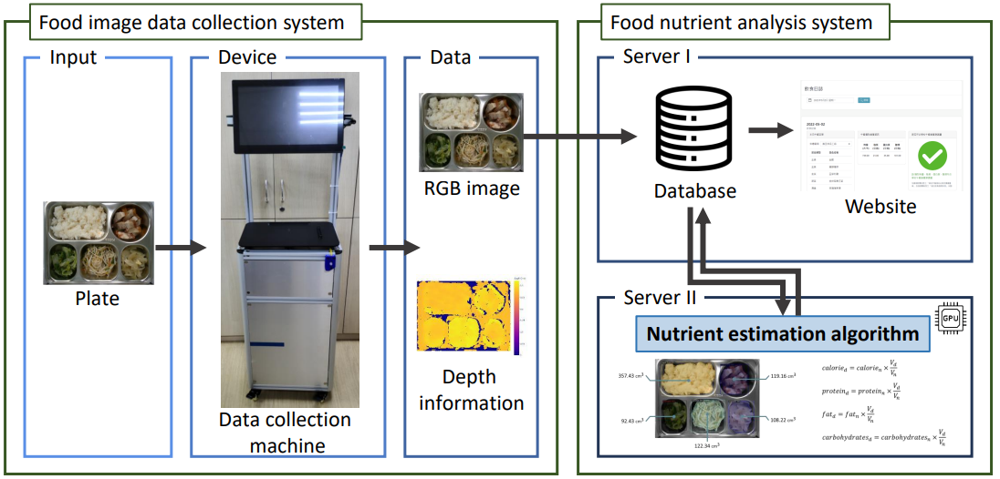
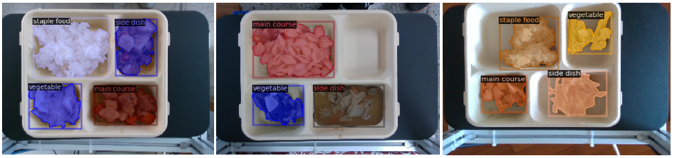
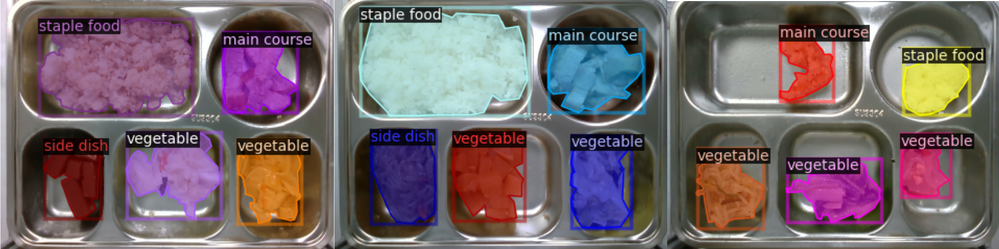
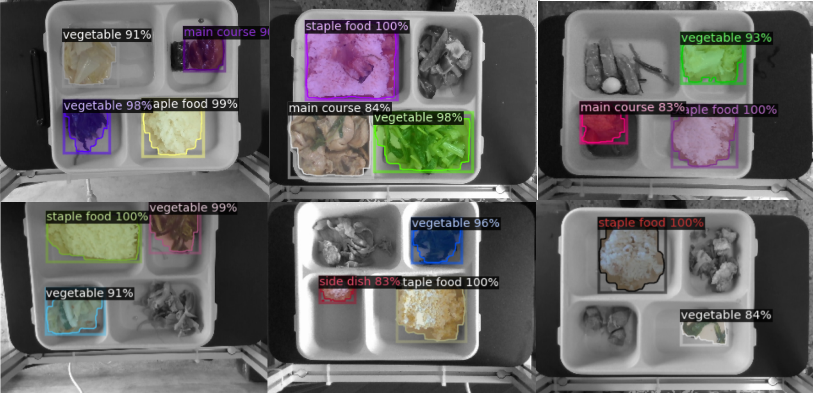

#  Food Instance Segmentation  
**NCKU "Introduction to Neural Networks" – Final Project**

---

<p align="center">
  
</p>
<p align="center">
  
</p>

---

##  Categories

1. Staple Food  
2. Main Course  
3. Side Dish  
4. Vegetable

---

##  Dataset Description

 [Download Dataset](https://drive.google.com/drive/folders/1uu-1P_gHhqjskyVrUhJIfH9uUvaInEiT?usp=sharing)

| Category     | Instances |
|--------------|-----------|
| Staple Food  | 1174      |
| Main Course  | 1022      |
| Side Dish    | 965       |
| Vegetable    | 1268      |
| **Total**    | **4429**  |

---

##  Labeling Tools

-  Detection: [LabelImg](https://github.com/HumanSignal/labelImg)
-  Segmentation: [LabelMe](https://github.com/wkentaro/labelme)

---

##  Dependencies & Setup

> Environment: `pytorch-21.06-py3`

### 1. Download Pretrained Weights
```bash
wget -q https://dl.fbaipublicfiles.com/detectron2/COCO-Detection/faster_rcnn_R_50_C4_3x/137849393/model_final_f97cb7.pkl 
```

### 2. Install Dependencies
```bash
sudo apt-get update
sudo apt-get install ffmpeg libsm6 libxext6 -y
```

---

## 🧪 Code Overview

###  `show_images.py`
Check dataset images and annotations

```bash
python show_images.py
```

<p align="center">
  
</p>

---

###  `train.py`
Train and evaluate the segmentation model

```bash
python train.py
```

---

###  `inference.py`
Visualize predictions on test images

```bash
python inference.py
```

<p align="center">
  
</p>

---

##  Experiment Results

### 1. BBox Evaluation

|   AP   |  AP50  |  AP75  |  APs   |  APm   |  APl   |
|:------:|:------:|:------:|:------:|:------:|:------:|
| 61.920 | 80.313 | 74.643 | 12.612 | 47.781 | 68.195 |

### 2. Per-Category BBox AP

| Category    | AP     |
|-------------|--------|
| Staple Food | 78.647 |
| Main Course | 52.682 |
| Side Dish   | 48.953 |
| Vegetable   | 67.399 |

---

### 3. Segmentation Evaluation

|   AP   |  AP50  |  AP75  |  APs  |  APm   |  APl   |
|:------:|:------:|:------:|:-----:|:------:|:------:|
| 44.442 | 78.253 | 49.255 | 2.878 | 27.602 | 51.990 |

### 4. Per-Category Segmentation AP

| Category    | AP     |
|-------------|--------|
| Staple Food | 57.265 |
| Main Course | 34.415 |
| Side Dish   | 32.760 |
| Vegetable   | 53.329 |

---

